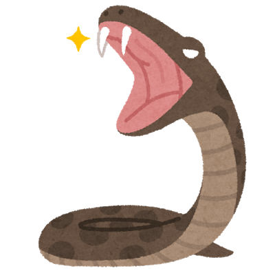
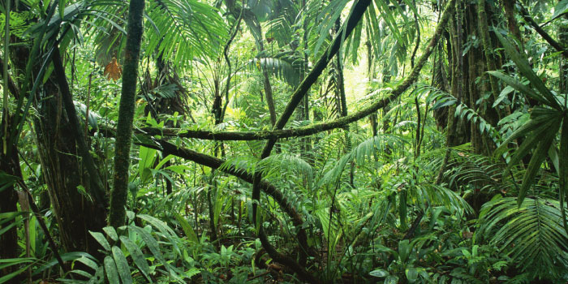
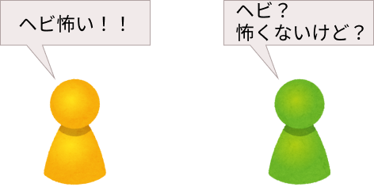
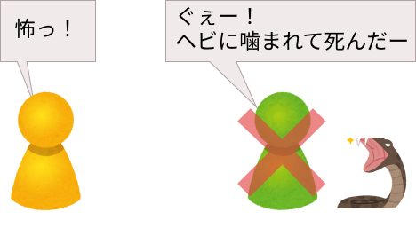
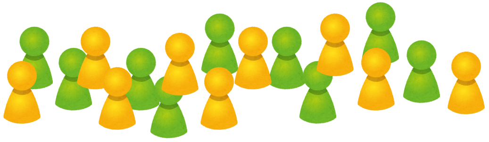
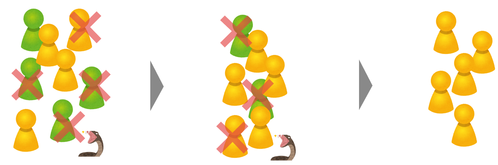
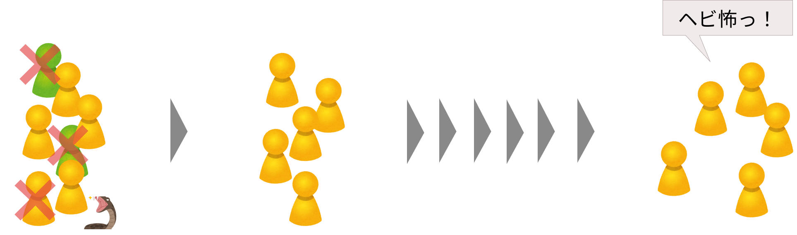
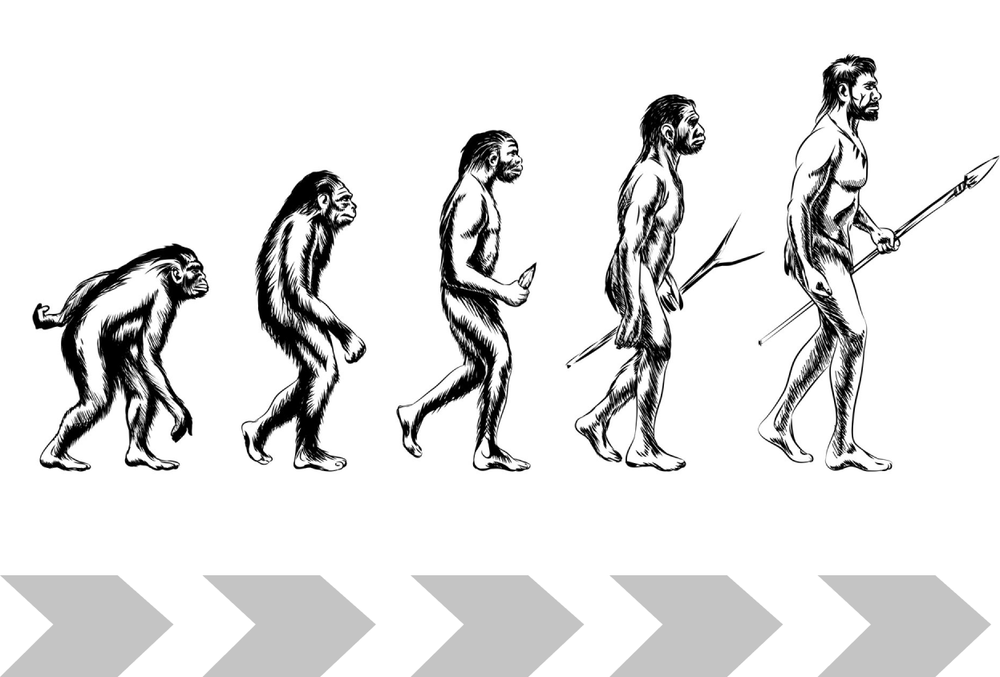

# 進化心理学入門の入門（第１回）

### @Jam House アマテラス

---

# 自己紹介

---

# 今日の目標

- 「進化心理学的な考え方」を覚えて帰る
- 「人は〇〇であるべきだ！」という考えからちょっとだけ解放される

---

# 進化心理学とは

- 「**ヒトの心の働き**」を「**過酷な環境の中で生き延びる**」という観点から解明していく学問

---

# 今日のお題

以下の 4 つの働きについて、進化心理学的な観点から解明していきます。

- **なぜヘビを怖いと思うのか**
- **なぜ高い所に登ると足がすくむのか**
- **なぜ甘い物は美味しいと感じるのか**
- **なぜ怪我をすると痛いのか**

---

# お題「なぜヘビを怖いと思うのか」



---

# お題「なぜヘビを怖いと思うのか」①

```
1. まずは太古の昔（50 万年前）のジャングル生活を想像します。
```



---

<!-- text:white -->

# お題「なぜヘビを怖いと思うのか」②

```
2. 次に【ヘビを怖がるタイプ】のヒトと【ヘビを怖がらないタイプ】のヒトを想像します。
```




---

## お題「なぜヘビを怖いと思うのか」③

```
3. 過酷な環境の中で、【ヘビを怖がるタイプ】のヒトと【ヘビを怖がらないタイプ】のヒト
  のどちらが生き残りやすかったかを考えます。
```




---

## お題「なぜヘビを怖いと思うのか」④

```
4. 今度は【ヘビを怖がるタイプ】のヒトと【ヘビを怖がらないタイプ】のヒトをたくさん用意します。
```




---

## お題「なぜヘビを怖いと思うのか」⑤

```
5. 世代を経るにつれて、【ヘビを怖がるタイプ】のヒトだけが生き残り、
【ヘビを怖がらないタイプ】のヒトは子孫を残せなかったと考えます。
```




---

## お題「なぜヘビを怖いと思うのか」⑥


```
6. 現代に生きる人は、生き残った人たちの子孫であるため、
当然【ヘビを怖がるタイプ】のヒトであると考えます。
```



---

## 進化心理学の論法 ①~③

1. 太古の昔のジャングル生活を想定します。
2. 【ある特性】と【正反対の特性】を持ったヒトを用意します。
3. ジャングル生活の中で、どちらがより生き残りやすかったかを考えます。

---

## 進化心理学の論法 ④,⑤

4. 2 つの特性を持ったヒトをたくさん用意します。
5. 世代を経るにつれて、【ある特性】を持つヒトだけが生き残り、そうでないヒトは死んでしまったと考えます。

---

## 進化心理学の論法 ⑥

6. 現代人は、生き残ったヒトの子孫であるため、当然【ある特性】を持っていると考えます。

---

# みんなで一緒に考えよう！

- **なぜヘビを怖いと思うのか（復習）**
- なぜ高い所に登ると足がすくむのか
- なぜ甘い物は美味しいと感じるのか
- なぜ怪我をすると痛いのか

---

## お題「なぜヘビを怖いと思うのか」①（復習）

```
1. まずは太古の昔（50 万年前）のジャングル生活を想像します。
```


---

## お題「なぜヘビを怖いと思うのか」②（復習）

```
2. 次に【ヘビを怖がるタイプ】のヒトと【ヘビを怖がらないタイプ】のヒトを想像します。
```


---

## お題「なぜヘビを怖いと思うのか」③（復習）

```
3. 過酷な環境の中で、【ヘビを怖がるタイプ】のヒトと【ヘビを怖がらないタイプ】のヒト
  のどちらが生き残りやすかったかを考えます。
```


---

## お題「なぜヘビを怖いと思うのか」④（復習）

```
4. 今度は【ヘビを怖がるタイプ】のヒトと
【ヘビを怖がらないタイプ】のヒトをたくさん用意します。
```


---

## お題「なぜヘビを怖いと思うのか」⑤（復習）

```
5. 世代を経るにつれて、【ヘビを怖がるタイプ】のヒトだけが生き残り、
【ヘビを怖がらないタイプ】のヒトは子孫を残せなかったと考えます。
```


---

## お題「なぜヘビを怖いと思うのか」⑥（復習）


```
6. 現代に生きる人は、生き残った人たちの子孫であるため、
当然【ヘビを怖がるタイプ】のヒトであると考えます。
```


---

# みんなで一緒に考えよう！

- なぜヘビを怖いと思うのか
- **なぜ高い所に登ると足がすくむのか**
- なぜ甘い物は美味しいと感じるのか
- なぜ怪我をすると痛いのか

---

## お題「なぜ高い所に登ると足がすくむのか」①

```
1. まずは太古の昔（50 万年前）のジャングル生活を想像します。
```


---

## お題「なぜ高い所に登ると足がすくむのか」②

```
2. 次に【高い所を怖がるタイプ】のヒトと【高い所を全く怖がらないタイプ】のヒトを想像します。
```


---

## お題「なぜ高い所に登ると足がすくむのか」③

```
3. 過酷な環境の中で、【高い所を怖がるタイプ】のヒトと【高い所を全く怖がらないタイプ】のヒト
  のどちらが生き残りやすかったかを考えます。
```


---

## お題「なぜ高い所に登ると足がすくむのか」④

```
4. 今度は【高い所を怖がるタイプ】のヒトと【高い所を全く怖がらないタイプ】のヒトをたくさん用意します。
```


---

## お題「なぜ高い所に登ると足がすくむのか」⑤

```
5. 世代を経るにつれて、【高い所を怖がるタイプ】のヒトだけが生き残り、
【高い所を全く怖がらないタイプ】のヒトは子孫を残せなかったと考えます。
```


---

## お題「なぜ高い所に登ると足がすくむのか」⑥


```
6. 現代に生きる人は、生き残った人たちの子孫であるため、
当然【高い所を怖がるタイプ】のヒトであると考えます。
```


---

# みんなで一緒に考えよう！

- なぜヘビを怖いと思うのか
- なぜ高い所に登ると足がすくむのか
- **なぜ甘い物は美味しいと感じるのか**
- なぜ怪我をすると痛いのか

---

## お題「なぜ甘い物は美味しいと感じるのか」①

```
1. まずは太古の昔（50 万年前）のジャングル生活を想像します。
```


---

## お題「なぜ甘い物は美味しいと感じるのか」②

```
2. 次に【甘い物を美味しいと感じるタイプ】のヒトと
【甘い物を全く美味しいと感じないタイプ】のヒトを想像します。
```


---

## お題「なぜ甘い物は美味しいと感じるのか」③

```
3. 過酷な環境の中で、【甘い物を美味しいと感じるタイプ】のヒトと
【甘い物を全く美味しいと感じないタイプ】のヒト  のどちらが生き残りやすかったかを考えます。
```


---

## お題「なぜ甘い物は美味しいと感じるのか」④

```
4. 今度は【甘い物を美味しいと感じるタイプ】のヒトと
【甘い物を全く美味しいと感じないタイプ】のヒトをたくさん用意します。
```


---

## お題「なぜ甘い物は美味しいと感じるのか」⑤

```
5. 世代を経るにつれて、【甘い物を美味しいと感じるタイプ】のヒトだけが生き残り、
【甘い物を全く美味しいと感じないタイプ】のヒトは子孫を残せなかったと考えます。
```


---

## お題「なぜ甘い物は美味しいと感じるのか」⑥


```
6. 現代に生きる人は、生き残った人たちの子孫であるため、
当然【甘い物を美味しいと感じるタイプ】のヒトであると考えます。
```


---

# みんなで一緒に考えよう！

- なぜヘビを怖いと思うのか
- なぜ高い所に登ると足がすくむのか
- なぜ甘い物は美味しいと感じるのか
- **なぜ怪我をすると痛いのか**

---

## お題「なぜ怪我をすると痛いのか」①

```
1. まずは太古の昔（50 万年前）のジャングル生活を想像します。
```


---

## お題「なぜ怪我をすると痛いのか」②

```
2. 次に【怪我をしたら痛みを感じるタイプ】のヒトと
【怪我をしても全く痛みを感じないタイプ】のヒトを想像します。
```


---

## お題「なぜ怪我をすると痛いのか」③

```
3. 過酷な環境の中で、【怪我をしたら痛みを感じるタイプ】のヒトと
【怪我をしても全く痛みを感じないタイプ】のヒト  のどちらが生き残りやすかったかを考えます。
```


---

## お題「なぜ怪我をすると痛いのか」④

```
4. 今度は【怪我をしたら痛みを感じるタイプ】のヒトと
【怪我をしても全く痛みを感じないタイプ】のヒトをたくさん用意します。
```


---

## お題「なぜ怪我をすると痛いのか」⑤

```
5. 世代を経るにつれて、【怪我をしたら痛みを感じるタイプ】のヒトだけが生き残り、
【怪我をしても全く痛みを感じないタイプ】のヒトは子孫を残せなかったと考えます。
```


---

## お題「なぜ怪我をすると痛いのか」⑥


```
6. 現代に生きる人は、生き残った人たちの子孫であるため、
当然【怪我をしたら痛みを感じるタイプ】のヒトであると考えます。
```


---

## 今日のまとめ

- ヒトのこころの働きを考えるときは、まず太古のジャングルの生活で生き延びることを考える
- 現代人は、ジャングルで生き残ったヒト達の子孫であるためジャングルで生き延びるための特徴を備えている
- 「人は〇〇であるべきだ！」って考えなくても良いと感じてくれれば OK

---

# おまけ

---

### 進化心理学の入門の入門

- 今日の内容は主に「個体の生存」に着目した話
- そのため、今日の話だけでは説明が着かないこともたくさんある
- 簡単のために、ごまかしている箇所もある
- 第 2 回講座を開催するかは未定（要望が強ければ開催するかも）

---

#### 進化とは



- **サル**として生まれたら**サル**として死ぬ
- 個体が成長して別の種族に変化することはない
- **ポケモン**の進化は**ウソ**、「進化」ではなく「変態」
- **たまたま生き延びた**やつだけが、次の世代へ子孫を残せた
- 生死を繰り返す中で、集団全体の特徴が変化したとき、それを進化と呼ぶ
