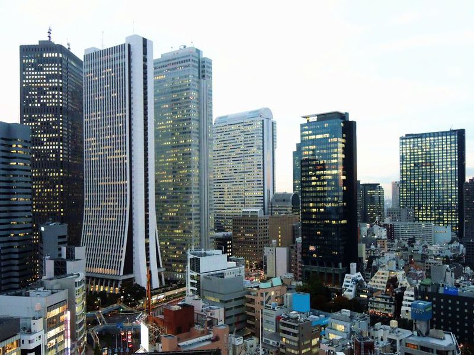

# 進化心理学入門の入門（第１回）

### @Jam House アマテラス

---

## 自己紹介

---

## 今日の目標

- 「進化」への誤解を解くこと
- 「進化心理学的な考え方」を身に着けること

---

## 進化心理学とは（1）

- ［進化］［心理］学

---

## 進化とは（1）

よくあるイメージ


誤解：サルっぽいやつが頑張ってヒトに近づいてきた

---

## 進化とは（2）

進化の実際

過酷な環境で生き残ったものだけが子孫を残せた

---

## 心理とは（1）

ヒトの心の働き

---

## 心理学とは（2）

「なぜ人間のこころの働きは〇〇なのか？」の仕組みを解明していく学問

---

## 進化心理学とは（2）

「進化」の論理を使って、人間の心理を説明する学問

---

## 今日のお題

- なぜヘビを怖いと思うのか
- なぜ高い所に登ると、足がすくむのか
- なぜ甘いもの食べると美味しいと感じるのか
- なぜ怪我をすると痛いと感じるのか

---

## お題「なぜヘビを怖いと思うのか」


---

## お題「なぜヘビを怖いと思うのか」①

```
1. まずは太古の昔（50 万年前）のジャングル生活を想像します。
```


---

<!-- text:white -->

## お題「なぜヘビを怖いと思うのか」②

```
2. 次に【ヘビを怖がるタイプ】のヒトと【ヘビを怖がらないタイプ】のヒトを想像します。
```


---

## お題「なぜヘビを怖いと思うのか」③

```
3. 過酷な環境の中で、【ヘビを怖がるタイプ】のヒトと【ヘビを怖がらないタイプ】のヒト
  のどちらが生き残りやすかったかを考えます。
```


---

## お題「なぜヘビを怖いと思うのか」④

```
4. 今度は【ヘビを怖がるタイプ】のヒトと【ヘビを怖がらないタイプ】のヒトをたくさん用意します。
```


---

## お題「なぜヘビを怖いと思うのか」⑤

```
5. 世代を経るにつれて、【ヘビを怖がるタイプ】のヒトだけが生き残り、
【ヘビを怖がらないタイプ】のヒトは子孫を残せなかったと考えます。
```


---

## お題「なぜヘビを怖いと思うのか」⑥



```
6. 現代に生きる人は、生き残った人たちの子孫であるため、
当然【ヘビを怖がるタイプ】のヒトであると考えます。
```


---

## 進化心理学の論法 ①~③

1. 太古の昔のジャングル生活を想定します。
2. 【ある特性】と【正反対の特性】を持ったヒトを用意します。
3. ジャングル生活の中で、どちらがより生き残りやすかったかを考えます。

---

## 進化心理学の論法 ④,⑤

4. 2 つの特性を持ったヒトをたくさん用意します。
5. 世代を経るにつれて、【ある特性】を持つヒトだけが生き残り、そうでないヒトは死んでしまったと考えます。

---

## 進化心理学の論法 ⑥

6. 現代人は、生き残ったヒトの子孫であるため、当然【ある特性】を持っていると考えます。

---

## おさらい

---

## お題「なぜヘビを怖いと思うのか」（おさらい）

---

## お題「なぜヘビを怖いと思うのか」①（おさらい）

---

## お題「なぜヘビを怖いと思うのか」②（おさらい）

---

## お題「なぜヘビを怖いと思うのか」③（おさらい）

---

## お題「なぜヘビを怖いと思うのか」④（おさらい）

---

## お題「なぜヘビを怖いと思うのか」⑤（おさらい）

---

## お題「なぜヘビを怖いと思うのか」⑥（おさらい）

---

## みんなで一緒に考えよう！

---

## お題「なぜ高い所に登ると、足がすくむのか」


---

## お題「なぜ高い所に登ると、足がすくむのか」①

---

## お題「なぜ高い所に登ると、足がすくむのか」②

---

## お題「なぜ高い所に登ると、足がすくむのか」③

---

## お題「なぜ高い所に登ると、足がすくむのか」④

---

## お題「なぜ高い所に登ると、足がすくむのか」⑤

---

## お題「なぜ高い所に登ると、足がすくむのか」⑥

---

## お題「なぜ甘いもの食べると美味しいと感じるのか」

---

## お題「なぜ甘いもの食べると美味しいと感じるのか」①

---

## お題「なぜ甘いもの食べると美味しいと感じるのか」②

---

## お題「なぜ甘いもの食べると美味しいと感じるのか」③

---

## お題「なぜ甘いもの食べると美味しいと感じるのか」④

---

## お題「なぜ甘いもの食べると美味しいと感じるのか」⑤

---

## お題「なぜ甘いもの食べると美味しいと感じるのか」⑥

---

## お題「なぜ怪我をすると痛いと感じるのか」

---

## お題「なぜ怪我をすると痛いと感じるのか」①

---

## お題「なぜ怪我をすると痛いと感じるのか」②

---

## お題「なぜ怪我をすると痛いと感じるのか」③

---

## お題「なぜ怪我をすると痛いと感じるのか」④

---

## お題「なぜ怪我をすると痛いと感じるのか」⑤

---

## お題「なぜ怪我をすると痛いと感じるのか」⑥

---

## 今日のまとめ
